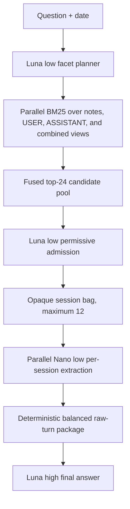

# MemoryBench

MemoryBench is a research workspace for building and evaluating long-term-memory
agents on LongMemEval-S. The current system uses opaque-ID retrieval and
evidence extraction to recover the smallest useful set of past sessions before
answering.

## Current result

The system scored **457/500 (91.40%)** on the complete 500-question
LongMemEval-S evaluation.

| Metric | Result |
|---|---:|
| Overall accuracy | **457/500 (91.40%)** |
| Task-averaged accuracy | **92.74%** |
| Answerable questions | 431/470 (91.70%) |
| Abstention questions | 26/30 (86.67%) |
| Candidate-pool full-gold coverage | 494/500 (98.80%) |
| Selected-bag full-gold coverage | 471/500 (94.20%) |
| Approximate total benchmark cost | **$14.7–$15** |

The cost is the rounded end-to-end budget for the 500-question benchmark,
including one-time session ingestion, retrieval, evidence extraction, final
answering, and canonical judging. Ingestion is reusable across later question
runs; experimental development runs before the selected architecture are not
part of this figure. Provider metering and output length can move the exact
bill slightly, so the cost is intentionally reported as a range.

### Accuracy by question type

| Question type | Correct | Accuracy |
|---|---:|---:|
| Knowledge update | 74/78 | 94.87% |
| Multi-session | 116/133 | 87.22% |
| Single-session assistant | 56/56 | 100.00% |
| Single-session preference | 27/30 | 90.00% |
| Single-session user | 68/70 | 97.14% |
| Temporal reasoning | 116/133 | 87.22% |

## Why the score is credible

- The result covers **all 500 questions**, rather than a selected development
  slice.
- All **19,195 unique sessions** were freshly ingested for the certification
  run. No earlier annotation cache or query-time model output was reused.
- Every stage completed for all 500 questions with **zero unresolved case
  failures**.
- Raw LongMemEval session IDs were never shown to the models. The audit checked
  all 19,195 storer prompts and every retrieval and downstream prompt set and
  found **zero raw-ID leaks**.
- Answers were scored with the pinned canonical evaluator,
  `gpt-4o-2024-08-06` at temperature 0.
- Exact prompts, structured outputs, request IDs, token usage, latency, and
  retry counts were retained for every model-dependent stage.
- The candidate pool contained every gold session for 98.80% of questions and
  the final selected bag did so for 94.20%, independently measuring retrieval
  before answer quality.

This is a single complete benchmark run, not a claim that 91.40% transfers
unchanged to every production workload. The full protocol and failure
decomposition are recorded in
[the full benchmark certification](src/agents/current/architecture/0008-FULL500-CERTIFICATION-2026-07-31.md).



| Stage | Implementation |
|---|---|
| Session ingestion | GPT-5.4 Nano, USER turns only |
| Facet planning and admission | GPT-5.6 Luna, low reasoning |
| Candidate discovery | Deterministic local multi-view BM25 |
| Per-session evidence extraction | GPT-5.4 Nano, low reasoning |
| Final answer | GPT-5.6 Luna, high reasoning |
| Canonical judge | GPT-4o, temperature 0 |

The planner creates concrete entity, date, amount, and temporal query lanes.
Local search executes those lanes across structured notes and raw-turn views
in parallel. A recall-first 24-session pool is fused, then a permissive
admission step selects at most 12 complementary sessions. Nano extracts exact
question-bearing turns independently per session, deterministic code builds a
balanced evidence package, and Luna produces the final answer.

Of the 43 incorrect answers, **35 already had every gold session in the final
bag**; only 8 lacked full-gold retrieval. The largest remaining opportunity is
therefore downstream multi-session and temporal reasoning, not candidate
discovery.

The complete design is documented in
[the current architecture](src/agents/current/ARCHITECTURE.md) and
[the detailed system specification](src/agents/current/architecture/0008-hop-hybrid-arm3.md).

## Repository structure

```text
src/
├── agents/
│   ├── current/                                  ← active system
│   ├── architecture-0003.2-hybrid-graph-reader/  ← preserved research line
│   └── baselines/full_context/                   ← frozen Architecture 0001
└── longmemeval/                                  ← stable benchmark harness
```

Historical architectures remain preserved so measurements and design
decisions can be audited without rewriting prior results.

## Benchmark pins

| Component | Pin |
|---|---|
| LongMemEval repository | `9e0b455f4ef0e2ab8f2e582289761153549043fc` |
| Cleaned dataset | `98d7416c24c778c2fee6e6f3006e7a073259d48f` |
| Canonical judge | `gpt-4o-2024-08-06`, temperature `0` |

Apache-2.0. See [LICENSE](LICENSE).
