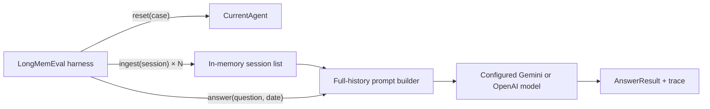

# 0001: Full-context agent

## Purpose

Establish the simplest correct implementation of the LongMemEval agent contract before adding a
custom memory layer.

## State

Each benchmark case owns an isolated in-memory list of sanitized `TimestampedSession` objects.
`reset` clears the list, ensuring no memory leaks between questions.

## Data flow

## Components

- `system.py`: lifecycle, state, provider request, result trace.
- `prompt.py`: full-history serialization and answer instructions.
- `config.py`: `chain_of_note` and history-format options.
- `configs/`: exact model, provider, canary, and full-run configurations.

## Deliberately absent

- embedding or lexical retrieval;
- long-term storage;
- summaries or consolidation;
- entity or relationship graphs;
- temporal indexing;
- reranking;
- evidence pruning;
- multi-stage reasoning.

## Known behavior

Quality depends primarily on the answer model's ability to reason over roughly 113K input tokens.
The architecture is expensive but serves as a transparent correctness baseline for later designs.
