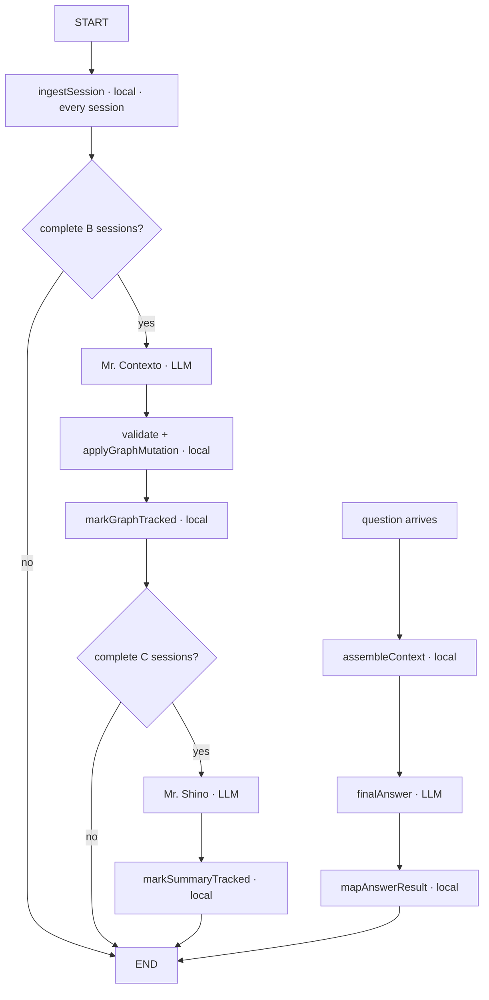

# Architecture 0003 — TypeScript LangGraph Contexto/Shino Agent

## Decision

Architecture 0003 replaces the active Python Architecture 0002 agent with a TypeScript LangGraph
workflow. It keeps the Python LongMemEval dataset, sanitization, run, judge, report, and publication
layers unchanged. One Node host is started per benchmark run and serves isolated case workflows over
versioned NDJSON on stdin/stdout.

The implementation follows the same structural style as AutoPilot V2—thin workflow, typed state,
small nodes, deterministic services, YAML prompts, direct SDKs—while using LangGraph's current
`StateSchema` and Zod v4 API.

## Boundaries

```text
Python LongMemEval harness
  │ reset / ingest / answer (NDJSON protocol v1)
  ▼
TypeScript host — one process per run
  ├── case A: isolated LangGraph state + artifact namespace
  ├── case B: isolated LangGraph state + artifact namespace
  └── shared role semaphores: contexto / shino / answer
```

Stdout is RPC only. Redacted diagnostics go to `agent-host.log` on stderr. Secrets stay in provider
environment variables. A host crash fails in-flight requests but cannot corrupt completed atomic
artifacts.

## Typed state and memory

Zod schemas are the runtime source of truth. Strict TypeScript, `noUncheckedIndexedAccess`, and
`exactOptionalPropertyTypes` are enabled; architecture source contains no `any`.

```ts
type MasterContextGraph = {
  schemaVersion: 1;
  revision: number;
  context: JsonObject;
  provenanceByPointer: Record<JsonPointer, SourceReference[]>;
};
```

The envelope is fixed and the `context` payload is intentionally dynamic. Context keys use lowercase
`snake_case`; `__proto__`, `prototype`, `constructor`, and undeclared `$...` keys are forbidden.
Cross-branch links are values of the exact form `{ "$ref": "/context/..." }`. Provenance is indexed
by RFC 6901 pointer and names the source session, turn, date, and B batch.

## Workflow and cadence

The generated LangGraph topology is checked into
[`generated-workflow.mmd`](generated-workflow.mmd). Solid conceptual flow:



Configuration must satisfy `C >= B`, `C % B == 0`, and
`latest_raw_sessions >= C - 1`. Question arrival never triggers a partial Contexto or Shino call.
The raw-tail channel carries every incomplete window.

For N sessions:

```text
Contexto = floor(N / B)
Shino    = floor(N / C)
Answer   = 1
Total    = floor(N / B) + floor(N / C) + 1
```

## Mr. Contexto

Contexto sees the current graph and exactly the next B raw sessions. It proposes either an RFC
6901-addressed patch (`add`, `replace`, `remove`, `move`) or a whole graph replacement.

The model does not have write authority. Local code validates the complete proposal in a cloned
graph and commits only when every condition passes:

- key names and depth are safe;
- patch parents/targets have correct existence semantics;
- every source belongs to the current batch and names a real turn/date;
- every `$ref` resolves after the complete mutation;
- replacements cover every old leaf with an explicit migration/removal record;
- every replacement leaf has preserved or current-batch provenance.

Failure is atomic: the old graph and revision remain unchanged, a rejected mutation record is
written, and there is no repair LLM call. Every accepted or rejected proposal remains replayable.

## Mr. Shino

At each complete C-session boundary, Shino receives only:

- the complete master graph at that boundary;
- the IDs of the C sessions in the window.

It never receives raw sessions or the standalone diff ledger. Provenance in the graph is the bridge
between target IDs and relevant paths. Local code adds the window ID, session IDs, and graph revision
to the returned summary.

## Final answer

`assembleContext` writes a deterministic package containing:

- question and question date;
- complete current master graph and provenance index;
- ordered C-session Shino ledger;
- readable B-session Contexto mutation/diff history;
- latest configured raw sessions (nine in the initial experiment).

The final model returns `hypothesis`, evidence references, and
`supported | conflicted | insufficient`. `mapAnswerResult` removes unknown session/turn references,
records them in the trace, and maps the remainder to the benchmark contract.

There is deliberately no embedding, vector index, BM25, query planner, reranker, graph retrieval,
macro reflection, or hidden model call in Architecture 0003.

## Prompts and providers

Every instruction lives in one of three YAML files: `contexto.yaml`, `shino.yaml`, and
`final-answer.yaml`. Each declares its variables and output contract. Loading fails before any API
request when placeholders are missing, extra, misspelled, undeclared, or unused.

OpenAI uses the official TypeScript Responses API with Zod Structured Outputs. Gemini receives JSON
Schema generated from the same Zod contracts and is locally parsed again. The three roles can select
providers independently without topology changes.

OpenAI strict schemas require a top-level object, required fields, and closed object properties.
Contexto therefore transports arbitrary JSON values as a recursive tagged tree of
`string | number | boolean | null | array | object(entries[])`. Deterministic code rejects duplicate
keys and converts that provider-safe wire value into the exact dynamic `JsonValue` mutation before
the graph gate. This preserves dynamic keys without raw JSON strings or an unconstrained schema.

## Artifacts, replay, and resume

```text
runs/<run-id>/agent-artifacts/cases/<question-id>/
├── sessions.jsonl
├── events.jsonl
├── graph-mutations/b0001.json
├── summaries.jsonl
├── model-calls/
├── final-graph.json
├── final-context.json
├── answer.json
└── final.svg
```

Events are append-only, sequenced, schema-versioned, hash-chained, and graph-hashed. Validated model
responses are written atomically before deterministic application. On resume the host reconstructs
the graph, processes any complete-but-unapplied batch from its cached response, skips the durable
session prefix, and calls the provider only for genuinely missing work.

## Memory Observatory

The Hono server binds to `127.0.0.1`, exposes allowlisted read-only run/case routes, and streams new
event IDs over SSE. It has no control path back into the benchmark. React/Cytoscape renders the
nested JSON tree, `$ref` edges, Contexto mutations, Shino windows, before/after diffs, provenance,
raw turns, model calls, answer, and historical Python artifacts.

The observer derives every graph revision from mutation records; it is not a second source of truth.
Closing the browser or inspector process never interrupts the Node agent host.

## Controlled experiment

The initial pair is:

- OpenAI B3/C9;
- OpenAI B9/C9.

Every provider/model/parameter, C value, raw-tail size, selection, concurrency, and capture setting is
identical. Only run name and B differ. Both use `gpt-5-nano-2025-08-07` for Contexto, Shino, and the
answer role. No paid run is part of the implementation commit.

## References

- [LangGraph Graph API](https://docs.langchain.com/oss/javascript/langgraph/graph-api)
- [OpenAI Structured Outputs](https://developers.openai.com/api/docs/guides/structured-outputs)
- [Gemini Structured Outputs](https://ai.google.dev/gemini-api/docs/structured-output)
- [Hono streaming/SSE](https://hono.dev/docs/helpers/streaming)
- [RFC 6901 JSON Pointer](https://www.rfc-editor.org/info/rfc6901/)
