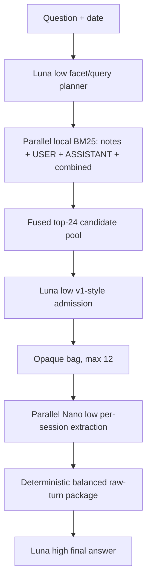

# Current architecture

**Architecture ID:** `0008-hop-hybrid-arm3`
**Status:** selected / measured — answerable135 **123/135 (91.11%)**
**Design:** [architecture/0008-hop-hybrid-arm3.md](architecture/0008-hop-hybrid-arm3.md)
**Checkpoint:** [architecture/0008-CHECKPOINT-2026-07-31.md](architecture/0008-CHECKPOINT-2026-07-31.md)

## Selected pipeline

> **Opaque parallel multi-view hybrid retrieval → GPT-5.4 Nano low Arm 3
> extraction → GPT-5.6 Luna high final answer**

## Frozen measurement

| Metric | Result |
|---|---:|
| Candidate-pool full gold | 133/135 (98.52%) |
| Selected-bag full gold | 126/135 (93.33%) |
| Final answers | **123/135 (91.11%)** |
| Hard final answers | 21/28 (75.00%) |
| Mid final answers | 11/12 (91.67%) |
| Easy final answers | 91/95 (95.79%) |

All model-visible session identifiers are deterministic opaque per-question
`memory_###` handles. Raw dataset identifiers are rejected if they reach an API
prompt.

## Component contract

1. Luna-low decomposes the question into concrete evidence facets and lexical
   query lanes.
2. Local BM25 searches structured notes, raw USER turns, raw ASSISTANT turns,
   and combined raw turns in parallel.
3. Rank fusion retains at most 24 candidates.
4. The actual v1 retrieval methodology permissively admits promising and
   complementary sessions into a maximum-12 bag.
5. Nano-low independently maps each admitted session to exact raw-turn
   references.
6. Deterministic code builds a balanced package capped at 40 turns and 40,000
   characters.
7. Luna-high answers from that package using `answer-v8-preference`.

## Model decision

Changing only the final answerer from Nano-medium to Luna-high improved
accuracy from 116/135 (85.93%) to 123/135 (91.11%).

Changing the Arm 3 extractor from Nano-low to Luna-high tied at 123/135 while
raising extraction cost approximately 5.97 times. Nano-low therefore remains
selected for extraction.

## Cost

Estimated answerable135 inference cost before canonical judging:

- hybrid retrieval: $1.915;
- Nano-low extraction: $0.323;
- Luna-high final answer: $1.218;
- total: **$3.455**.

## Implementation status

Architecture 0008 is implemented and measured through the offline retrieval,
downstream, and answer-replay runners. Live host wiring remains pending and is
not part of this checkpoint.

Previous active architecture 0005.4.4 and all earlier designs remain preserved
under [architecture/](architecture/) and in
[architecture/LOG.md](architecture/LOG.md).
