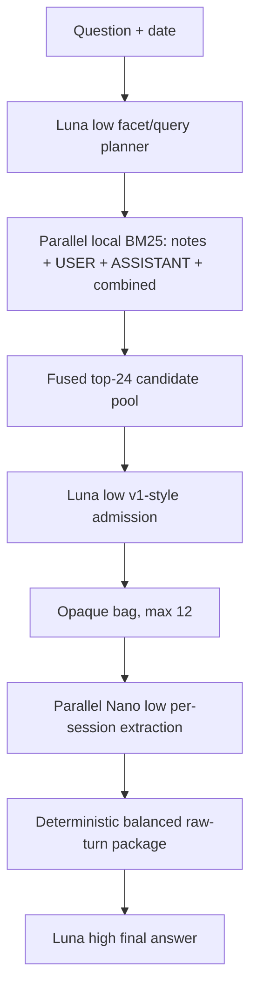

# Current architecture

**Architecture ID:** `0008-hop-hybrid-arm3`
**Status:** selected / full-500 certified — **457/500 (91.40%)**
**Design:** [architecture/0008-hop-hybrid-arm3.md](architecture/0008-hop-hybrid-arm3.md)
**Checkpoint:** [architecture/0008-CHECKPOINT-2026-07-31.md](architecture/0008-CHECKPOINT-2026-07-31.md)
**Certification:** [architecture/0008-FULL500-CERTIFICATION-2026-07-31.md](architecture/0008-FULL500-CERTIFICATION-2026-07-31.md)
**BEAM checkpoint:** [architecture/BEAM-1M-CANARY-A-CHECKPOINT-2026-08-01.md](architecture/BEAM-1M-CANARY-A-CHECKPOINT-2026-08-01.md)
**BEAM retrieval advancement gate:** [architecture/BEAM-1M-RETRIEVAL-ADVANCEMENT-GATE-2026-08-08.md](architecture/BEAM-1M-RETRIEVAL-ADVANCEMENT-GATE-2026-08-08.md)
**BEAM Phase-1 diagnosis:** [architecture/BEAM-1M-PHASE1-RETRIEVAL-DIAGNOSIS-2026-08-08.md](architecture/BEAM-1M-PHASE1-RETRIEVAL-DIAGNOSIS-2026-08-08.md)
**BEAM coverage-first compression workflow:** [architecture/BEAM-1M-COMPRESSION-WORKFLOW-2026-08-08.md](architecture/BEAM-1M-COMPRESSION-WORKFLOW-2026-08-08.md)
**BEAM alternative compression micro-gate:** [architecture/BEAM-1M-COMPRESSION-ALTERNATIVES-MICROGATE-2026-08-09.md](architecture/BEAM-1M-COMPRESSION-ALTERNATIVES-MICROGATE-2026-08-09.md)

**BEAM Coverage Explorer answer A/B:** [architecture/BEAM-1M-COMPRESSION-ANSWER-AB8-2026-08-09.md](architecture/BEAM-1M-COMPRESSION-ANSWER-AB8-2026-08-09.md)

## Selected pipeline

> **Opaque parallel multi-view hybrid retrieval → GPT-5.4 Nano low Arm 3
> extraction → GPT-5.6 Luna high final answer**

## Full-500 certification

| Metric | Result |
|---|---:|
| Candidate-pool full gold | 494/500 (98.80%) |
| Selected-bag full gold | 471/500 (94.20%) |
| Final answers | **457/500 (91.40%)** |
| Answerable final answers | 431/470 (91.70%) |
| Abstention final answers | 26/30 (86.67%) |
| Task-averaged accuracy | 92.74% |

All model-visible session identifiers are deterministic opaque per-question
`memory_###` handles. Raw dataset identifiers are rejected if they reach an API
prompt. The certification freshly ingested all 19,195 sessions, completed all
500 questions without unresolved failures, and found zero raw-ID leaks across
all audited model-visible prompts.

## Component contract

1. Luna-low decomposes the question into concrete evidence facets and lexical
   query lanes.
2. Local BM25 searches structured notes, raw USER turns, raw ASSISTANT turns,
   and combined raw turns in parallel.
3. Rank fusion retains at most 24 candidates.
4. The actual v1 retrieval methodology permissively admits promising and
   complementary sessions into a maximum-12 bag.
5. Nano-low independently maps each admitted session to exact raw-turn
   references.
6. Deterministic code builds a balanced package capped at 40 turns and 40,000
   characters.
7. Luna-high answers from that package using `answer-v8-preference`.

## Model decision

Changing only the final answerer from Nano-medium to Luna-high improved
accuracy from 116/135 (85.93%) to 123/135 (91.11%).

Changing the Arm 3 extractor from Nano-low to Luna-high tied at 123/135 while
raising extraction cost approximately 5.97 times. Nano-low therefore remains
selected for extraction.

## Cost

The complete 500-question benchmark costs approximately **$14.7–$15**,
including fresh ingestion, retrieval, Nano-low extraction, Luna-high final
answers, and canonical judging. Ingestion is reusable for later question runs
over the same corpus.

## Implementation status

Architecture 0008 is implemented and certified through the offline retrieval
and downstream evaluation pipeline. Live host wiring remains pending and is
not part of the certification.

The BEAM-1M adapter keeps this focused path unchanged for normal questions. An
explicit-order question-only router selects a wide-history profile for timeline
questions. On Canary A, the selected route has a controlled official macro of
**64.69%**, versus the **62.92%** frozen baseline. Architecture 0005.4 was rejected
for this role at **26.33%** event ordering versus **51.70%** for the selected route.

Previous active architecture 0005.4.4 and all earlier designs remain preserved
under [architecture/](architecture/) and in
[architecture/LOG.md](architecture/LOG.md).
