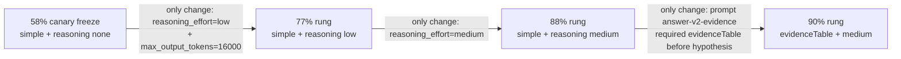
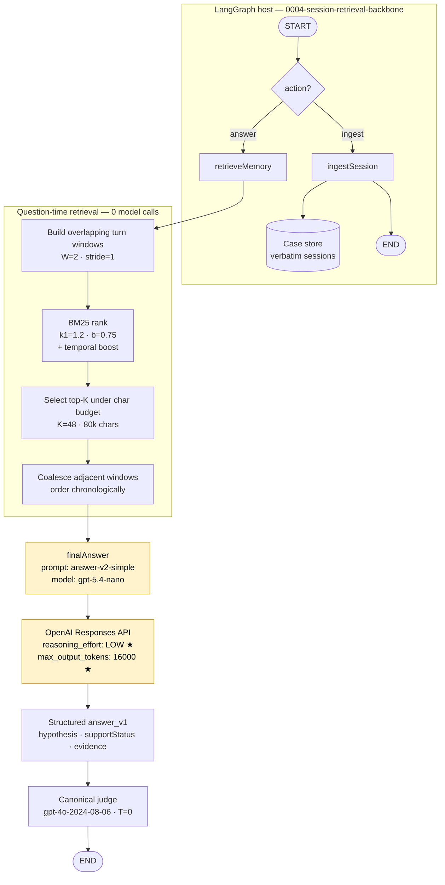
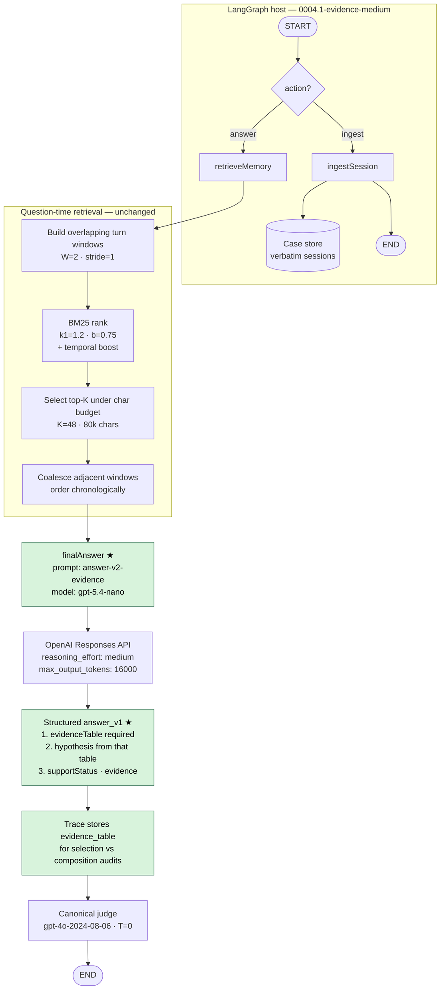

# Architecture 0004 → 0004.1 evolution (dev-60 ladder)

These diagrams track the answerer ladder on **`dev-60-v1`** after the canary-2
freeze at **35/60 (58.3%)** with `answer-v2-simple` and `reasoning_effort: none`.

`dev-60-v1` is contaminated by design. Treat these scores as development
readings, not blind results. Retrieval is identical in every rung below:
W2/S1/K48/80k BM25 turn windows, model `gpt-5.4-nano-2026-03-17`, one answer
call per question, zero write-time model calls.

| Rung | Score | Prompt | Reasoning | `max_output_tokens` | Run |
|---|---:|---|---|---:|---|
| Prior freeze (canary-2) | **35/60 (58.3%)** | `answer-v2-simple` | none | 4096 (default) | `20260725T232322.948641Z-architecture-0004-canary2-simple` |
| Control (dev-60) | 34/60 (56.7%) | `answer-v2-simple` | none | default | `20260725T231234.316966Z-architecture-0004-dev60-simple` |
| **A — 77%** | **46/60 (76.7%)** | `answer-v2-simple` | **low** | **16000** | `20260726T004538.498095Z-architecture-0004-dev60-reason-low` |
| **B — 88%** | **53/60 (88.3%)** | `answer-v2-simple` | **medium** | 16000 | `20260726T011248.022136Z-architecture-0004-dev60-reason-medium` |
| **C — 90%** | **54/60 (90.0%)** | **`answer-v2-evidence`** | medium | 16000 | `20260726T013535.463820Z-architecture-0004-dev60-evidence` |

Exact filled prompts + model/gold answers (including WRONGs):

- [77% exact-prompts](../../../../runs/20260726T004538.498095Z-architecture-0004-dev60-reason-low/exact-prompts.md)
- [88% exact-prompts](../../../../runs/20260726T011248.022136Z-architecture-0004-dev60-reason-medium/exact-prompts.md)
- [90% exact-prompts](../../../../runs/20260726T013535.463820Z-architecture-0004-dev60-evidence/exact-prompts.md)

---

## What changed between rungs



Unchanged across A/B/C: ingest path, BM25 retrieval, coalescing, chronology,
model, judge, case concurrency, and the single-call answer shape.

---

## A — 76.7% (`answer-v2-simple` + reasoning low)

Same graph as the 58% freeze, except the answer node is allowed a small
amount of internal reasoning and a larger output budget.



**Delta vs 58% freeze**

- `reasoning_effort: none` → **`low`**
- `max_output_tokens` raised to **16000** so reasoning tokens do not starve the JSON answer
- Prompt text unchanged (`answer-v2-simple`)
- Measured lift on `dev-60-v1`: **56.7% → 76.7%** (~+20pp), mostly temporal / multi-session

---

## B — 88.3% (`answer-v2-simple` + reasoning medium)

Still the same retrieval + simple prompt. Only the reasoning knob moves.


**Delta vs 77% rung**

- `reasoning_effort: low` → **`medium`**
- Prompt and retrieval unchanged
- High reasoning was **not** completed (wall-clock)
- Measured lift on `dev-60-v1`: **76.7% → 88.3%** (~+11.6pp)

---

## C — 90.0% (`answer-v2-evidence` + reasoning medium) — frozen as 0004.1

Same backbone and medium reasoning. The prompt/schema now force an explicit
`evidenceTable` before the hypothesis so the model must surface dated memory
facts first, then answer from that list.



**Delta vs 88% rung**

- Prompt: `answer-v2-simple` → **`answer-v2-evidence`**
- Schema: `evidenceTable` is required and emitted **before** `hypothesis`
- User message adds: list entity-bearing facts first; do not abstain if the list is non-empty
- Reasoning stays **medium**; no second model call / no two-stage reader
- Measured lift on `dev-60-v1`: **88.3% → 90.0%** (+1.7pp / +1 case)
- Frozen checkpoint: [0004.1-CHECKPOINT-2026-07-26.md](0004.1-CHECKPOINT-2026-07-26.md)

---

## Prompt shape at each rung

### Shared user envelope (all rungs)

```text
Today is {{question_date}}.
Question: {{question}}

Memory from earlier conversations (oldest first):
{{retrieved_memory}}
```

### A / B — `answer-v2-simple` closing line

```text
Answer the question.
```

### C — `answer-v2-evidence` closing lines

```text
First list evidenceTable facts that share entities with the question.
Then answer the question using only that list. Do not abstain if the
list is non-empty.
```

System instructions for C keep the simple-prompt abstention rules and add the
ordered return contract: `evidenceTable` → `hypothesis` → `supportStatus` →
`evidence`.
