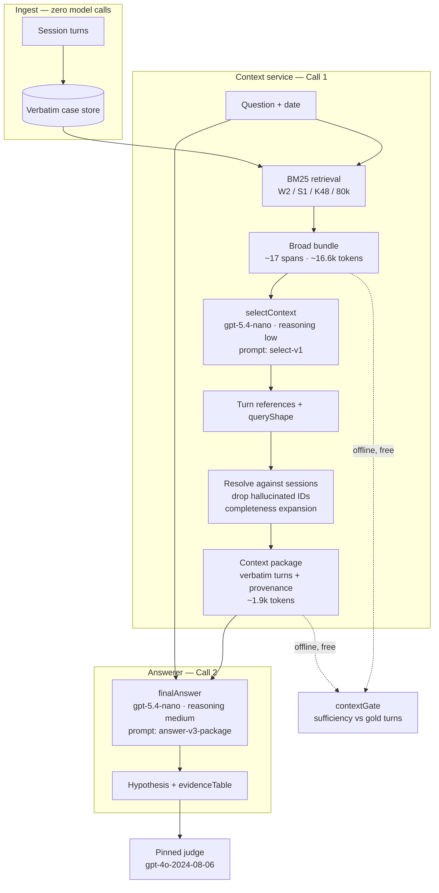

# Architecture 0005 — context service

**Status:** measured on canary-2  
**Prior freeze:** [0004.2-CHECKPOINT-2026-07-27.md](0004.2-CHECKPOINT-2026-07-27.md) at **54/60 (90.0%)**

## Decision

Broad algorithmic retrieval stays. A small selector model turns the bundle into a
compact **verbatim** context package. A separate answering model sees only that
package. The product shape is a memory/context service, not a standalone Q&A agent.

```text
ingest(session)   → append verbatim                         (zero model calls)
answer(question)  → BM25 W2/S1/K48/80k
                  → selectContext (query shape + turn refs)
                  → resolve verbatim package (+ completeness expansion)
                  → answer from package only                (two model calls)
```



**Contract:** Call 1 returns context only. Call 2 never sees the raw BM25 bundle —
only the package. `select_enabled: false` skips Call 1 and restores the 0004.2
single-call path for A/B.

## Offline gate

`pnpm backbone:gate:context` reports sufficiency (every gold-supporting turn present)
and compactness versus the ~16,600-token canary-2 bundle baseline.

Raw-bundle ceiling on full 500: **90.6%** sufficiency, ~16,640 mean tokens.  
Raw-bundle ceiling on canary-2: **54/60 (90.0%)**.

## Config

`configs/architecture-0005-canary2-context-service.yaml`

- `select`: nano, `reasoning_effort: low`, prompt `select-v1` (turn catalog)
- `answer`: nano, `reasoning_effort: medium`, prompt `answer-v3-package`
- `select_enabled: true`
- package budgets: 40 turns / 40k chars

When `select_enabled` is false, the workflow skips the selector and behaves like 0004.2
for A/B (answer prompt must then be a bundle prompt such as `answer-v2-evidence`).

## Canary-2 measurement

Run: `20260726T225234.626771Z-architecture-0005-canary2-context-service`

| Metric | 0004.2 freeze | 0005 |
|---|---:|---:|
| Accuracy | **54/60 (90.0%)** | **50/60 (83.3%)** |
| Pop-weighted | 86.0% | 83.2% |
| Abstention | 10/10 | 7/10 |
| Package / answer tokens | ~16.6k into answer | **~1.9k** into answer (~8.8× compact) |
| Package sufficiency | n/a (bundle=90%) | **48/60 (80.0%)** |
| Model calls | 1 | select 60 + answer 60 |
| Cost | ~$0.24 | ~$0.33 |

Decision rule at n=60: accuracy within ~5 points of 54/60 is a **tie**. This run is
−4 points → tie on accuracy. Product metrics favor compactness (8.8×) but package
sufficiency is still **10 points below** the canary bundle ceiling, so further selector
work is justified before claiming a win. Do not revert solely on the −4 accuracy delta.

Call accounting: `expected_vs_actual` reports `select: 60/60`, `answer: 60/60`.

Exact prompts dump (both LLM calls + question / gold / model answer for all 60):
`runs/20260726T225234.626771Z-architecture-0005-canary2-context-service/exact-prompts.md`.
