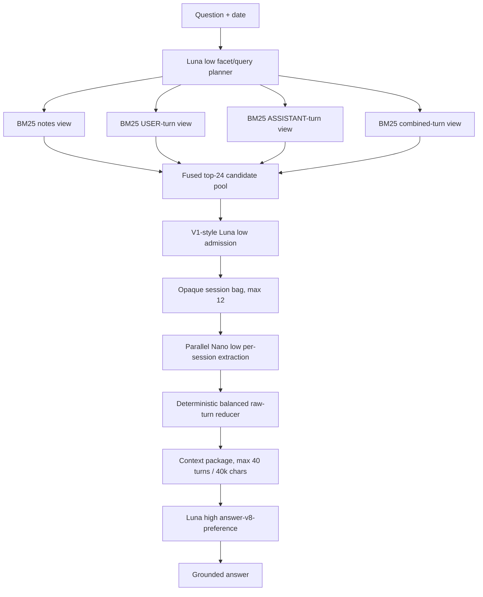

# Architecture 0008 — opaque hybrid hop retrieval + Arm 3 reader

**Status:** selected / measured
**Prior active:** [0005.4.4 breadth](0005.4.4-breadth.md)
**Checkpoint:** [0008-CHECKPOINT-2026-07-31.md](0008-CHECKPOINT-2026-07-31.md)

## Decision

The selected question-time architecture is:

> **Hybrid retrieval → GPT-5.4 Nano low Arm 3 extraction → GPT-5.6 Luna high final answer**

All model-visible session identifiers are deterministic opaque per-question
handles. Raw LongMemEval identifiers are used only by the host to hydrate and
score sessions; they are rejected if they reach a model prompt.

The frozen answerable135 measurement is:

- candidate-pool full gold: **133/135 (98.52%)**
- selected-bag full gold: **126/135 (93.33%)**
- end-to-end accuracy: **123/135 (91.11%)**
- hard retrieval: **22/28 (78.57%)**
- hard final answers: **21/28 (75.00%)**

This is the selected benchmark architecture. The implementation is currently
available through the offline hop and downstream runners; wiring it into the
live host remains separate work.

## Pipeline

## Retrieval

### 1. Facet and query planning

`gpt-5.6-luna` with low reasoning decomposes the question into concrete
evidence facets and lexical query lanes. Queries favor entities, products,
dates, amounts, places, old/new values, temporal endpoints, and distinct
aggregate members.

### 2. Parallel multi-view discovery

Local deterministic BM25 executes the original question and planned queries
against four views:

1. frozen structured session notes;
2. raw USER turns;
3. raw ASSISTANT turns;
4. combined raw turns.

Reciprocal-rank-style fusion creates a maximum 24-session candidate pool. This
stage has no model search calls after planning.

### 3. V1-style admission

The complete candidate catalog is passed to the actual `hop-retrieve-v1`
methodology for one `add_sessions` decision using `gpt-5.6-luna` low.
Admission is deliberately permissive: retain every promising direct or
complementary session instead of constructing a minimal set cover. The bag is
capped at 12 sessions.

On answerable135:

- 3,237 candidate entries were exposed across 135 questions;
- 279/281 required gold-session occurrences were discovered;
- 2,958 candidate entries were non-gold;
- admission reduced this to 307 bag entries: 268 gold and 39 non-gold.

The pool is recall-first; the bag is the precision boundary.

## Arm 3 reader

Every admitted session is hydrated from the raw conversation.
`gpt-5.4-nano-2026-03-17` with low reasoning independently maps each session
to question-bearing claims with exact turn references.

The host then constructs a deterministic balanced package:

1. reserve one bounded raw excerpt per candidate session;
2. add adjacent conversational context;
3. add further evidence round-robin across sessions;
4. cap the result at 40 turns and 40,000 characters.

Extracted claims are routing labels only. The final package contains verbatim
raw turns.

## Final answer

`gpt-5.6-luna` with high reasoning answers from the frozen Arm 3 package using
`answer-v8-preference`.

Changing only the final answer model improved the hybrid pipeline:

| Final answerer | Correct | Accuracy |
|---|---:|---:|
| GPT-5.4 Nano medium | 116/135 | 85.93% |
| **GPT-5.6 Luna high** | **123/135** | **91.11%** |

The paired result was 10 Luna wins, 3 losses, and 122 ties.

## Rejected extraction upgrade

Replacing Nano-low Arm 3 extraction with Luna-high did not improve aggregate
accuracy:

| Extractor | Final answerer | Correct | Accuracy |
|---|---|---:|---:|
| **Nano low** | **Luna high** | **123/135** | **91.11%** |
| Luna high | Luna high | 123/135 | 91.11% |

The paired result was 6 wins and 6 losses. Luna extraction cost about 5.97
times as much as Nano extraction, so Nano-low remains selected.

## Identity isolation

The raw dataset identifiers leaked oracle membership because gold identifiers
used an `answer_*` prefix while non-gold identifiers did not. Architecture
0008 therefore applies a deterministic hash permutation per question and
exposes only `memory_###` handles.

Guards reject any API request containing a raw per-case session identifier.
Retrieval, per-session extraction, context packages, and final answers all use
opaque handles.

Historical raw-ID measurements remain research artifacts, not certified
baselines.

## Cost

Estimated answerable135 query-time inference cost, excluding the canonical
judge:

| Stage | Cost |
|---|---:|
| Hybrid retrieval | $1.915 |
| Nano-low Arm 3 extraction | $0.323 |
| Luna-high final answer | $1.218 |
| **Total** | **$3.455** |

The rejected Luna-high extraction variant increased the complete pipeline to
approximately $4.990 without improving accuracy.

## Canonical files

- `src/retrieval/opaqueSessionIds.ts`
- `src/scripts/hopArchitectureScreen.ts`
- `src/scripts/hopBagDownstreamGate.ts`
- `src/scripts/hopArm3AnswerReplay.ts`
- `prompts/hop-facet-plan-v1.yaml`
- `prompts/hop-retrieve-v1.yaml`
- `prompts/hop-session-extract-v1.yaml`
- `prompts/answer-v8-preference.yaml`

## Measurement artifacts

- `runs/local-archive/backbone/hop-gate-luna-h6-v1-answerable135-opaque.json`
- `runs/local-archive/backbone/hop-answerable135-hybrid-v1-opaque.json`
- `runs/hop-answerable135-opaque-hybrid-arm3-20260731-3`
- `runs/hop-answerable135-opaque-hybrid-arm3-luna-20260731-high`
- `runs/hop-answerable135-opaque-hybrid-arm3-lunahigh-20260731-3`

Detailed analysis:
[HOP-ANSWERABLE135-DOWNSTREAM-V1-VS-HYBRID-2026-07-31.md](HOP-ANSWERABLE135-DOWNSTREAM-V1-VS-HYBRID-2026-07-31.md).
