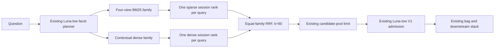

# Architecture 0008.2 — multi-retriever ensemble 1

**Status:** implemented; retrieval recall gate failed; not selected or certified

**Control:** [0008-hop-hybrid-arm3.md](0008-hop-hybrid-arm3.md)

**Pre-implementation checkpoint:** `3e487d1abd6751b4df4163b746fa6a0f59e1dec8`

## Decision boundary

Architecture 0008 remains the selected pipeline. Architecture 0008.2 changes
only candidate discovery: it adds a question-independent semantic session index
and equal-family rank fusion to the existing four-view BM25 retriever. Facet
planning, admission, bag limits, Arm 3 extraction, context packaging, opaque
identifiers, and final answering remain unchanged.

The answer-shaped 0008.1 workflow is not combined with this arm. This isolates
whether semantic candidate discovery adds evidence beyond lexical retrieval.

## Flow

## Semantic corpus

Each session is one document. Frozen notes, USER turns, ASSISTANT turns, the
session date, role labels, and turn positions are split deterministically at
turn boundaries into roughly 512-token chunks. Provider-visible text does not
contain the raw session ID. The persisted local metadata retains provenance so
dense hits can be hydrated and converted into per-question opaque handles.

The index is question-independent and content-addressed. Each corpus directory
contains:

- `manifest.json` — provider/model/dimension, chunker version, usage, and hashes;
- `chunks.json` — exact provider-visible chunks plus local provenance;
- `vectors.f32` — normalized float32 embeddings.

The loader checks both content hashes and exact vector dimensions. Search is an
exact local cosine scan, not approximate ANN. This is tractable because a BEAM
1M conversation produces only approximately two thousand 512-token chunks.

## Providers

The provider interface supports:

- Voyage `voyage-context-4`, 1024 dimensions;
- Google `gemini-embedding-2`, 1536 dimensions and official asymmetric prefixes;
- OpenAI `text-embedding-3-large`, 3072 dimensions.

Voyage is the initial candidate because chunks from one session are embedded as
one contextualized document. The three providers are bakeoff alternatives, not
three simultaneous production embedding calls.

## Fusion

Every existing facet query and the original question run through both families.
Four sparse views are first collapsed into one stable sparse session list per
query using best rank, view support, and deterministic tie-breaking. Dense chunk
hits are collapsed to sessions using maximum chunk cosine.

The two families then receive equal weight:

`0.5 * mean_query_RRF(sparse) + 0.5 * mean_query_RRF(dense)`

with `k=60`. This prevents four sparse views from numerically outvoting one
dense retriever. Focused and broad-history pool/bag limits are unchanged.

## Isolation and auditability

- No question, oracle, gold session, ability label, or question ID is used to
  build document embeddings.
- Raw session IDs are stored only in local index metadata and are never placed
  in provider text or model prompts.
- Query embeddings are logged separately from one-time document-index usage.
- Per-case traces record sparse ranks, dense cosine hits, chunk provenance,
  family contributions, fused pool, admission request, and admitted bag.
- The existing `hybrid` arm and its output behavior are unchanged.

## Canonical implementation

- `src/retrieval/semanticTypes.ts`
- `src/retrieval/semanticChunker.ts`
- `src/retrieval/semanticProviders.ts`
- `src/retrieval/semanticIndex.ts`
- `src/retrieval/hybridRankFusion.ts`
- `src/scripts/buildSemanticIndex.ts`
- `src/scripts/hopArchitectureScreen.ts --arm hybrid-dense`
- `src/scripts/beam1mCanary.ts --retrieval-arm hybrid-dense`

## Promotion protocol

1. Build identical Canary-A indexes for Voyage, Gemini, and OpenAI.
2. Run paired retrieval gates and select by full-gold pool, mean recall,
   incremental gold beyond BM25, false positives, latency, then cost.
3. Run only the winning provider through the existing downstream pipeline.
4. Require at least +7 points candidate recall, +5 full-gold pools, +5 points
   bag recall, and at least 68.5% official Canary-A score.
5. Require at least 122/135 on LongMemEval answerable135.
6. Freeze code and configuration before a paired control/candidate Canary-B
   certification. Do not tune and reuse Canary-B afterward.

Until these gates pass, 0008.2 is research-only and 0008 remains selected.

## Recall-gate result

The fresh 100-question Canary-A retrieval-only gate on August 2, 2026 did not
qualify for downstream scoring. Voyage semantic discovery improved candidate
mean gold recall from 61.24% to 66.93% and candidate full-gold coverage from
46/100 to 50/100. However, unchanged V1 admission reduced selected-bag mean
gold recall from 54.65% to 47.46%, and full-gold bags fell from 39/100 to
30/100. The candidate improvement also missed the precommitted +7-point and
+5-case thresholds by 1.31 points and one case.

The ensemble is therefore not a shippable architecture in its current form.
Detailed counts and ability deltas are recorded in
[0008.2-RECALL-GATE-2026-08-02.md](0008.2-RECALL-GATE-2026-08-02.md).
