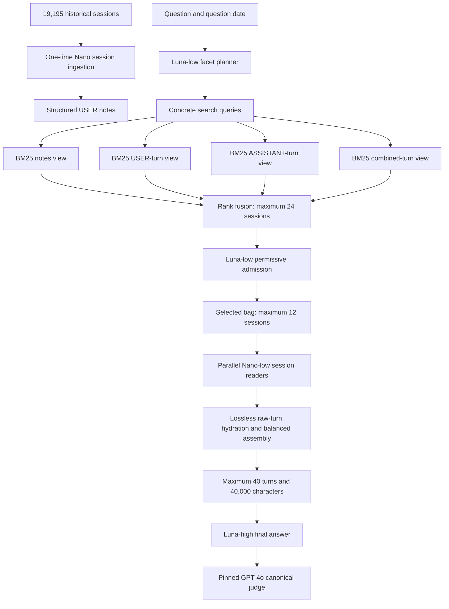
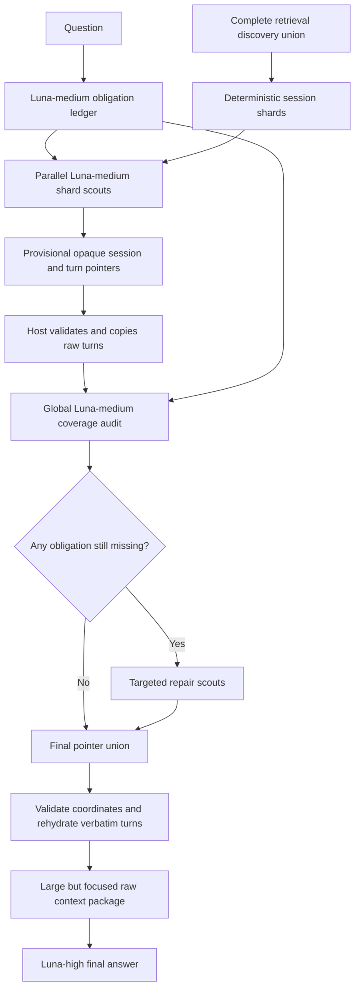

# The three important memory-system results

This document intentionally covers only three things:

1. Architecture 0008, which scored 91.40% on the complete LongMemEval-S benchmark.
2. Coverage Explorer, the retrieval-hungry approach that succeeded on eight deliberately difficult BEAM questions.
3. The K=81 raw-context BEAM pipeline that scored 74.10%, followed by the ingestion work that attempted to replace its expensive per-question behavior.

## 1. Architecture 0008 — 91.40% on LongMemEval-S

### Result and purpose

Architecture 0008 is the strongest completed and certified system in this repository.

| Measurement | Result |
|---|---:|
| Complete benchmark | 500 questions |
| Candidate pool contains every gold session | 494/500 = 98.80% |
| Selected bag contains every gold session | 471/500 = 94.20% |
| Final answers | **457/500 = 91.40%** |
| Answerable questions | 431/470 = 91.70% |
| Abstention questions | 26/30 = 86.67% |
| Task-averaged accuracy | 92.74% |
| Approximate complete benchmark cost | $14.7–$15 |

The system was designed for a history containing many separate sessions. It does not send the complete history to the final model. Instead, it progressively reduces the history from thousands of sessions to a small, high-confidence evidence package.

### Complete flow



### Step 1 — ingest every session once

The benchmark contained 19,195 unique sessions. Every session was freshly ingested with `gpt-5.4-nano-2026-03-17`.

The ingester read USER turns and produced compact notes containing useful facts, events, entities, dates, values and search terms. These notes were not treated as final truth. Their purpose was to create a searchable view of the history.

The raw USER and ASSISTANT turns remained available. This mattered because a compressed note could omit an exact phrase, and some questions explicitly depended on something previously said by the assistant.

Ingestion is reusable: after one corpus has been indexed, later questions do not require re-ingesting all sessions.

### Step 2 — hide session identities

The original LongMemEval session IDs leaked benchmark membership: gold IDs followed an `answer_*` naming pattern while non-gold IDs did not.

Before any model call, the host converted all real session IDs into deterministic per-question handles such as:

```text
memory_001
memory_002
memory_003
```

The model could use a handle to select a session, but it could not infer whether that session was gold from its name. Raw IDs remained host-side for hydration and scoring. Prompt guards rejected any request that accidentally contained a raw session ID.

This identity isolation applied to retrieval, extraction, context construction and final answering.

### Step 3 — plan what evidence the question needs

`gpt-5.6-luna` with low reasoning received the question and its date. It divided the question into concrete evidence facets.

Examples of facets include:

- the earlier and later values of something that changed;
- both endpoints of a time interval;
- each member needed for an aggregate or list;
- a person's name and the associated place, product or preference;
- a contradiction and the later correction;
- an amount, date or named event likely to appear literally in the history.

The planner then generated lexical query lanes. It was instructed to prefer entity-, date-, amount- and answer-shaped terms over vague phrases such as `preference comparison` or `progress update`.

The output of this stage was a structured facet plan and a small set of concrete search queries. It did not select sessions and did not answer the question.

### Step 4 — search four different views in parallel

Every planned query, plus the original question, ran through local BM25 indexes over four views:

1. structured session notes;
2. raw USER turns;
3. raw ASSISTANT turns;
4. USER and ASSISTANT turns combined.

Why four views were needed:

- Notes were compact and usually best for ordinary USER facts.
- Raw USER turns preserved exact numbers, phrasing and details omitted from notes.
- ASSISTANT turns were necessary for assistant-memory questions.
- The combined view helped when meaning depended on a USER–ASSISTANT exchange.

Search was deterministic and local after query planning. The model did not make one tool call per BM25 search.

The hit lists were fused into a recall-first candidate pool capped at 24 sessions. A session could gain support by appearing for several facets, queries or views, but the pool also reserved room for complementary evidence instead of only keeping repetitions of the dominant theme.

On the complete benchmark, this 24-session pool contained every required session for 494 of 500 questions.

### Step 5 — select a small complementary session bag

The complete candidate catalog was passed to `gpt-5.6-luna` at low reasoning using the proven v1 admission methodology.

The important design choice was permissive admission. Earlier experiments tried to find the mathematically smallest cover and became too conservative. Architecture 0008 instead asked Luna to retain every session that looked directly useful or complementary.

The output was a bag capped at 12 opaque session handles.

The candidate pool was the recall boundary; the bag was the precision boundary:

- candidate pool: broad enough not to lose the answer;
- selected bag: small enough not to distract downstream models.

Across all 500 questions, the bag averaged only 2.09 sessions and still contained every gold session for 471 questions.

### Step 6 — read each selected session independently

Every admitted session was hydrated from the raw corpus. Independent `gpt-5.4-nano` low-reasoning workers read the sessions in parallel.

Each worker returned:

- the question-bearing claims it found;
- exact raw-turn indexes;
- the local evidence around those turns;
- whether the session was direct evidence, supporting context or irrelevant.

The worker's generated claims were used as routing instructions, not as final evidence. This distinction prevented a generated paraphrase from silently replacing the original source.

We tested Luna-high in this extraction role. Accuracy stayed exactly 123/135 while extraction cost increased approximately 5.97 times. Nano-low therefore remained the selected reader.

### Step 7 — build the final evidence package deterministically

The host used the workers' turn references to copy verbatim raw turns from the selected sessions.

Assembly followed a balanced policy:

1. reserve a bounded raw excerpt for every selected session;
2. include adjacent turns needed to understand the exchange;
3. add further evidence round-robin so one verbose session cannot consume the entire context;
4. stop at 40 raw turns or 40,000 characters.

No deterministic code decided semantic truth. It only validated references, copied source text and enforced the package budget.

The final model therefore saw a compact set of original conversation turns rather than summaries or synthetic claims.

### Step 8 — answer with the stronger model

`gpt-5.6-luna` with high reasoning received the question and the frozen raw-turn evidence package. It used the `answer-v8-preference` contract to:

- answer only from supplied evidence;
- preserve dates, numbers, polarity and update order;
- enumerate before counting;
- distinguish suggestions from adopted actions;
- abstain when the evidence was genuinely insufficient.

Changing only this final model from Nano-medium to Luna-high improved the 135-question development score from 116/135 to 123/135, a gain of 5.19 percentage points.

### What the final 91.40% tells us

Of the 43 incorrect final answers:

- 35 already had every gold session in the selected bag;
- only 8 were missing one or more gold sessions.

Thus Architecture 0008 largely solved LongMemEval retrieval. Its remaining weakness was reasoning over multi-session and temporal evidence after successful retrieval. Both categories scored 87.22%; single-session assistant questions scored 100%.

The certification used all 500 questions, freshly ingested all 19,195 sessions, completed every pipeline stage, found zero raw-ID leaks and used the pinned `gpt-4o-2024-08-06` judge at temperature 0.

Canonical design: [0008-hop-hybrid-arm3.md](0008-hop-hybrid-arm3.md).
Certification: [0008-FULL500-CERTIFICATION-2026-07-31.md](0008-FULL500-CERTIFICATION-2026-07-31.md).

## 2. Coverage Explorer — retrieval-hungry, quality-first context exploration

### What problem it addressed

BEAM histories are much larger and less neatly separated than LongMemEval histories. A broad question may require evidence scattered across hundreds of sessions.

A normal top-K retriever repeatedly finds the most obvious central topic. It can still miss one obscure side event, correction or milestone needed to complete the answer. Earlier Nano claim compression made this worse: discovery preserved 74/75 certified evidence atoms, but the compressed claim package preserved only 29/75 and zero of 12 complete stories.

Coverage Explorer was built around a different rule:

> Spend more work at retrieval time, but never replace evidence with a generated summary. The model may point to source turns; only original raw turns become final evidence.

This makes it a **retrieval-hungry approach**. It is appropriate when answer quality matters more than query-time cost or when an expensive investigative query is acceptable.

### Simple mental model

Imagine searching a warehouse for everything needed to reconstruct a story.

- The obligation ledger writes the shopping list.
- Shard scouts search different warehouse aisles in parallel.
- The global auditor lays everything on a table and checks the shopping list.
- Repair scouts revisit only the aisles that may contain missing pieces.
- The host copies the original evidence into the final box.

The system never asks one model to read the entire warehouse and summarize it from memory.

### Complete flow



### Step 1 — start from the complete discovery union

Coverage Explorer did not begin with the top 12 or top 81 sessions. It reconstructed every unique session surfaced by any sparse or dense retrieval query.

No rank threshold, semantic selector or post-retrieval K was allowed to delete sessions before exploration. If a required session was present anywhere in discovery, the explorer had a chance to recover it.

Session IDs were converted to opaque handles before model calls.

### Step 2 — write an obligation ledger

`gpt-5.6-luna` at medium reasoning read only the question and created a checklist of what a complete answer would require.

For example, a broad progress summary might need:

- original objective;
- major workstreams;
- important implementation milestones;
- setbacks or failed attempts;
- later corrections or changed decisions;
- current status.

The ledger described evidence categories, not factual answers. It was not allowed to invent project names, dates or values that had not yet been retrieved.

### Step 3 — divide the huge history into shards

The discovery union could contain hundreds of sessions and hundreds of thousands of tokens. Deterministic code divided it into bounded shards that Luna could inspect safely.

Each shard included complete source sessions with opaque coordinates. Sharding was only a size-management operation; it did not rank or semantically remove anything.

### Step 4 — send parallel scouts

Parallel Luna-medium scouts received:

- one shard of raw sessions;
- the question;
- the obligation ledger.

They returned only source addresses and routing labels, such as:

```text
memory_143, turn 7 — possible evidence for milestone_2
memory_208, turns 3–5 — update and later correction
```

They did not output summaries as evidence. The host validated each coordinate and copied the named raw turns directly from the archive.

### Step 5 — audit the assembled story globally

The host assembled all valid scout selections into provisional raw evidence. A global Luna-medium auditor then checked that evidence against every obligation.

The auditor asked:

- Which checklist items are fully supported?
- Which are only partially supported?
- Which story branch is still absent?
- Which shard is most likely to contain the missing material?

This global pass was important. Independent scouts could each find locally relevant material without knowing that two pieces repeated the same milestone while an entirely different branch remained missing.

### Step 6 — revisit gaps

If the audit found gaps, repair scouts re-read targeted shards. The repair budget was capped at 35% of the discovery-union token estimate.

Initial and repair pointers were unioned. Invalid pointers were rejected mechanically. If a complete scout or audit call failed, the system failed open by retaining the affected raw shard or complete union rather than pretending that missing output meant irrelevant evidence.

### Step 7 — create the final package from raw turns

The final output was a list of validated session/turn coordinates. Deterministic code copied those exact USER and ASSISTANT turns into chronological order.

The answerer never saw generated claims, synthetic cards or model-written summaries as evidence. It saw original raw conversation text selected through the coverage workflow.

### Why the eight-question result mattered

The eight-question cohort deliberately contained the hardest broad-history shapes:

- four summarization questions;
- four multi-session reasoning questions.

These were development stress cases, not easy random lookups and not a population estimate.

| Final context | Official BEAM score | Mean sessions | Mean raw turns | Mean Luna input |
|---|---:|---:|---:|---:|
| Complete discovery union | 53.87% | 375.88 | 1,044.25 | 540,719 tokens |
| Coverage Explorer | **73.51%** | 236.25 | 661.50 | 340,025 tokens |

Coverage Explorer won four paired cases, tied four and lost none. It improved the score by 19.64 percentage points while reducing final-answer input by 37.12%.

Before this answer A/B, it also passed a four-question evidence micro-gate:

- 4/4 complete evidence stories;
- 25/25 evidence atoms;
- 12/12 gold sessions;
- 35.62% mean discovery tokens retained;
- only 2 invalid pointers among approximately 621 suggestions, both safely rejected.

### Why it was not selected as the general product path

Coverage Explorer improved answer quality, but it remained retrieval hungry:

- average final context was still 340,025 tokens;
- exploration calls cost $2.9611 across eight questions;
- complete Explorer cost was $0.5277 per question;
- directly feeding the raw discovery union cost $0.2789 per question.

The method paid extra to remove distracting evidence, not primarily to save money. Its successful lesson was that global coverage checking and targeted revisits help broad-history questions. Its unresolved problem was operational efficiency.

Canonical micro-gate: [BEAM-1M-COMPRESSION-ALTERNATIVES-MICROGATE-2026-08-09.md](BEAM-1M-COMPRESSION-ALTERNATIVES-MICROGATE-2026-08-09.md).
Eight-question A/B: [BEAM-1M-COMPRESSION-ANSWER-AB8-2026-08-09.md](BEAM-1M-COMPRESSION-ANSWER-AB8-2026-08-09.md).

## 3. The 74.10% BEAM pipeline and the ingestion work that followed

### Chronology correction

The event-card work did **not** produce the 74.10% score.

The order was:

1. build an expensive retrieval-time K=81 raw-context pipeline;
2. score 74.10% on the complete 100-question BEAM Canary A;
3. conclude that the quality was promising but the per-question context was too large;
4. try moving work from query time into reusable ingestion using atomic cards and later structured events;
5. stop before the ingestion architecture produced an end-to-end BEAM answer score.

Therefore 74.10% remains the best full-canary answer result. Ingestion was the attempted successor, not a component of that result.

### Story part 1 — Architecture 0008 reached roughly 65%

The initial LongMemEval architecture was adapted to BEAM. The frozen selected route scored 64.69%; a broader exploratory rerun scored 65.55%.

Point questions often worked. Broad summaries, multi-session stories and temporal questions still missed important history because a maximum-12 session bag was too restrictive.

### Story part 2 — we searched broadly and stopped compressing aggressively

We combined the available sparse and semantic search traces into one discovery union.

On the 78 focused answerable cases later analyzed in detail, discovery averaged 195.58 sessions per question. It retained 304 of 333 provisionally labelled gold sessions and contained the complete labelled story for 66/78 cases.

The discovery methods included:

- question and answer-shaped query planning;
- BM25 over notes and raw-turn views;
- Voyage semantic retrieval;
- initial and follow-up query traces.

The raw union was far too large to send routinely, so deterministic MMR fusion selected at most 81 sessions. MMR tried to balance relevance with diversity rather than selecting 81 near-duplicates of the same central theme.

The resulting reservoir contained 76.13 sessions per question on average.

### Story part 3 — we compared raw evidence against Nano compression

Both downstream arms used exactly the same K=81 reservoir and `gpt-5.6-luna` at high reasoning for the final answer.

#### Arm A: K=81 raw sessions

The host copied raw turns from every K=81 session into the final context. Nothing was semantically removed after K=81 selection.

Average final package:

- 76.13 represented sessions;
- 209.90 raw turns;
- 110,458 estimated tokens.

#### Arm B: K=81 Nano claims

`gpt-5.4-nano` read every K=81 session and emitted compressed claims. The final Luna context contained these claims instead of all raw turns.

Average final package:

- only 55.40 represented sessions;
- 342.40 claims;
- 11,873 estimated tokens.

This was 9.3 times smaller, but Nano made 5,938 extraction calls and processed 12.617 million tokens. More importantly, it silently lost useful evidence.

### Story part 4 — the raw arm won

The evaluation used the official 100-question Canary A.

For a cleaner causal comparison, 78 focused answerable questions were regenerated and the remaining 22 prior predictions were held fixed. The official evaluator was pinned to the upstream BEAM code, GPT-4.1-mini at temperature 0, and the official event-ordering metric.

| Pipeline | Complete official rerun | Paired-control score |
|---|---:|---:|
| Prior exploratory best | 65.55% | 65.55% |
| **K=81 raw sessions → Luna-high** | **74.10%** | **72.69%** |
| K=81 → Nano claims → Luna-high | 69.60% | 69.25% |

The paired score is the cleaner comparison because independently rerunning the official judge slightly changed scores even for identical answers.

On the 78 changed questions, the raw arm improved 22, tied 48 and regressed 8 relative to the prior best.

Its largest paired gains were:

- summarization: 35.60% → 62.70%;
- temporal reasoning: 20.00% → 50.00%;
- knowledge update: 85.00% → 95.00%;
- information extraction: 64.05% → 76.67%.

The answer stage for those 78 questions used 8.820 million Luna input tokens, cost approximately $9.99 and took 13 minutes 50 seconds. Shared retrieval and official judging were not included in that figure.

### Input and output contract of the 74.10% pipeline

#### Input

- one BEAM question;
- question date and opaque session space;
- previously built BM25 and Voyage indexes;
- raw USER and ASSISTANT turns for hydrated K=81 sessions.

#### Retrieval output

- an ordered reservoir of at most 81 opaque session handles;
- per-session sparse/dense retrieval evidence and fusion scores;
- no oracle or benchmark ability metadata exposed to the model.

#### Final-answer input

- all selected raw turns in chronological order;
- approximately 110,458 tokens per focused question on average;
- no Nano claim-compression layer.

#### Final output

- one Luna-high answer in the official BEAM answer format;
- official score 74.10%;
- paired-control score 72.69%.

### Story part 5 — why we shifted toward ingestion

The 74.10% result proved that the model could answer much better when it received a broad raw evidence reservoir. It also exposed the product problem: every new question repeated expensive retrieval and gave Luna roughly 110,000 tokens.

We therefore asked whether more work could happen once, when the million-token history was ingested, so that many future questions could query a smaller reusable representation.

### Story part 6 — atomic event cards v0

The first ingestion design created two planes:

1. an immutable byte-preserved raw archive;
2. query-blind atomic cards with exact source quotations.

For every session:

1. Nano read the session plus limited preceding context.
2. Nano proposed cards for facts, events, preferences, intentions and outcomes.
3. Deterministic code located each exact quotation in the raw turn and either materialized or quarantined the card.
4. Luna independently audited the session, rejected unsupported cards and added omissions.
5. Cards and provenance were frozen before evaluation questions were opened.

This sounded like event-card ingestion, but the implementation stored mostly flat normalized text with broad labels. It did not capture enough structured participant, stance, temporal and relationship information.

The primary run processed:

- 929 sessions;
- 2,612 turns;
- 1,220,778 raw tokens;
- 929 Nano calls and 929 Luna audit calls;
- $13.8879 ingestion cost.

Best result:

- 25/41 evidence atoms preserved = 60.98%;
- 5/12 complete stories;
- 4/6 critical contradiction/update/temporal stories;
- normalized card text alone still consumed 39.91% of raw tokens.

The run failed. The major causes were:

- assistant advice lists exploded into thousands of equal-weight cards;
- qualifiers and entity bindings were omitted;
- planned actions were sometimes converted into actual events;
- long-range references were unresolved;
- cross-session chronology and updates had no proper link representation;
- exact evidence was sometimes rejected by overly strict deterministic quote checks.

No downstream BEAM answer score was run from these cards.

### Story part 7 — structured-event ingestion v1

We then replaced flat cards with a more faithful structured representation.

A semantic record explicitly stored:

- predicate;
- typed participants and values;
- source speaker;
- assertion, request, recommendation or plan;
- polarity and certainty;
- proposed, ongoing, completed, failed or cancelled status;
- whether a suggestion was actually adopted;
- assertion time separately from event-valid time;
- exact source selectors and field-level support.

Long ASSISTANT lists became compact blocks with stable item addresses instead of hundreds of primary episodic facts. Updates, contradictions, references, adoption and chronological relations became a separate append-only typed-link overlay.

The raw archive remained authoritative. Every semantic object could reopen its original turn. LLMs retained responsibility for meaning; deterministic code was limited to byte custody, exact selectors, referential integrity, lossless assembly, lifecycle tracking and gate accounting.

A test ladder was added:

1. L0 static conformance to the approved specification;
2. L1 deterministic adversarial fixtures;
3. L2 tiny paid semantic/link falsification;
4. only then, larger ingestion rungs.

The latest completed L2 attempt, repair-15, achieved:

| Measurement | Result |
|---|---:|
| Direct USER semantic obligations | 2/2 |
| Assistant compact-route obligations | 3/3 |
| Complete semantic story | 1/1 |
| Preferred source occurrences | 4/5 |
| Supported active objects | 208/219 |
| Searchable semantic projection | 11.52% of raw tokens |
| Overall | Failed |

The remaining errors were one missing duplicate USER occurrence and unsupported or misjudged active links. Repair-16 added a duplicate-occurrence guard, confirmed-evidence link floor, endpoint-specific support packages and fail-fast provider handling. Its free suite reached 91/91 and L0/L1 passed, but the paid L2 rerun stopped when the API returned `no credits remaining` before semantic freeze.

Structured-event ingestion therefore has no final BEAM answer score. It remains an unfinished attempt to make the quality of the 74.10% retrieval-heavy system reusable at much lower future query cost.

Canonical 74.10% record: [BEAM K=81 downstream results](../../../../runs/beam-1m-k81-downstream-20260806/RESULTS.md).
Atomic-card result: [BEAM-1M-ATOMIC-INGESTION-V0-RESULTS-2026-08-09.md](BEAM-1M-ATOMIC-INGESTION-V0-RESULTS-2026-08-09.md).
Structured-event specification: [BEAM-1M-STRUCTURED-EVENT-INGESTION-V1-SPEC.md](BEAM-1M-STRUCTURED-EVENT-INGESTION-V1-SPEC.md).
